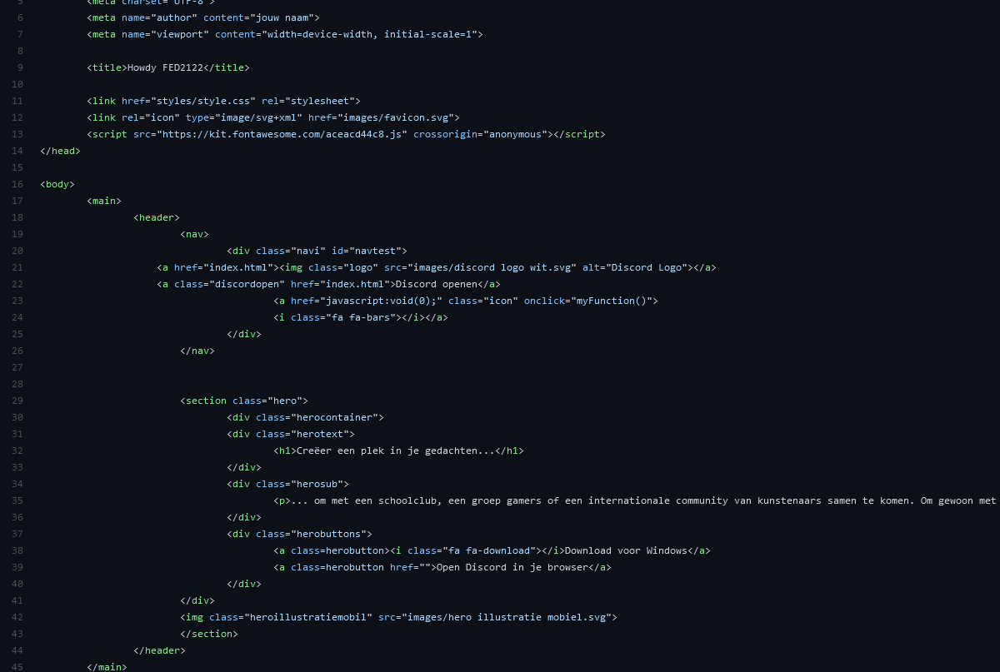

# Procesverslag
Markdown is een simpele manier om HTML te schrijven.  
Markdown cheat cheet: [Hulp bij het schrijven van Markdown](https://github.com/adam-p/markdown-here/wiki/Markdown-Cheatsheet).

Nb. De standaardstructuur en de spartaanse opmaak van de README.md zijn helemaal prima. Het gaat om de inhoud van je procesverslag. Besteedt de tijd voor pracht en praal aan je website.

Nb. Door *open* toe te voegen aan een *details* element kun je deze standaard open zetten. Fijn om dat steeds voor de relevante stuk(ken) te doen.

## Jij

uitwerken voor kick-off werkgroep

### Auteur:
Marijn de Bruin

#### Je startniveau:
Blauw / Rood

#### Je focus:
Responsive
 

## Je website

uitwerken voor kick-off werkgroep

### Je opdracht:
Ik wil de website van discord na maken.
www.discord.com
 
#### Screenshot(s) van de eerste pagina (small screen): 
hier de naam van de pagina  

#### Screenshot(s) van de tweede pagina (small screen):
hier de naam van de pagina  

 

## Breakdownschets (week 1)

uitwerken na afloop 2e werkgroep

### de hele pagina: 

### dynamisch deel (bijv menu): 

### wellicht nog een dynamisch deel (bijv filter): 

## Voortgang 1 (week 2)

uitwerken voor 1e voortgang

### Stand van zaken
Ik ben begonnen aan de website, Ik vond het moeilijker dan gedacht.
Ik was vergeten dat semantische HTML in hield dat je geen div's of id en classes kan gebruiken.
Hierdoor moet ik nieuwe aanpassingen maken, aangezien ik teveel div's heb op dit moment

### Agenda voor meeting
samen met je groepje opstellen

Hoe kan je het beste font responsive maken
Hoe maak je een responsive navigatie, zijn het 2 verschillende navigaties die je laat zien en weg haalt op bepaalde breedte?

### Verslag van meeting
hier na afloop snel de uitkomsten van de meeting vastleggen

- Ik heb geleerd hoe je het beste font resposive kan maken. Er waren verschillende manieren. Maar ik ga : font-size: clamp(1em, 4vw, 3em); gebruiken.
- Ik heb geleerd dat ik geen semantische HTML heb en hoe ik dit beter kan doen
- Ik heb geleerd over accesability 
- Ik heb geleerd dat een responsive navigatie zich aanpast op scherm grote en niet dat je 2 navigaties hebt.
- Geen font iconen :(
- Een section mag wel een class hebben.

 ### Mijn huidige progres
 

## Voortgang 2 (week 3)

uitwerken voor 2e voortgang

### Stand van zaken
Ik heb deze week semantishe HTML gemaakt, en bekeken wat daar onder valt.
Dit is voor mij vrij moeilijk omdat ik het mijzelf zo heb aangeleerd.
 

### Agenda voor meeting
samen met je groepje opstellen

Vragen:
- Waarom is er semantische HTML, wat is het nut van NTH-of-type ipv iets een class of ID geven.
- Zijn er sommige onderdelen waar je wel een class mag gebruiken?
- Hoe doe je NTH-of-type als je een 2e pagina hebt?
- Nog steeds moeite met een hamburger menu (aangezien menu content veranderd op discord.com)
 
### Verslag van meeting
hier na afloop snel de uitkomsten van de meeting vastleggen

- HTML en CSS zien er beter uit.
- Denk goed na over de structuur van je CSS bekijk de slides
- Maak comments in je html en css
- Kijk naar je sections en articles die in elkaar zitten in de main

## Toegankelijkheidstest (week 4)

uitwerken na test in 8e voortgang

### Bevindingen
Lijst met je bevindingen die in de test naar voren kwamen:

#### Titel eerste bevinding
Hier korte omschrijving (met indien nodig een afbeelding)

Hier een omschrijving van hoe het opgelost kan worden (met indien nodig een afbeelding)

#### Titel tweede bevinding. 
Hier korte omschrijving (met indien nodig een afbeelding)

Hier een omschrijving van hoe het opgelost kan worden (met indien nodig een afbeelding)

#### Titel volgende bevinding. 
Hier korte omschrijving (met indien nodig een afbeelding)

Hier een omschrijving van hoe het opgelost kan worden (met indien nodig een afbeelding)

#### Titel nog een bevinding. 
Hier korte omschrijving (met indien nodig een afbeelding)

Hier een omschrijving van hoe het opgelost kan worden (met indien nodig een afbeelding)

## Voortgang 3 (week 4)

uitwerken voor 3e voortgang

### Stand van zaken

Ik heb weer hard gewerkt aan de website en heb veel aanpassingen gemaakt.
Ik heb deze 'versie' veel gewerkt aan het zorgen dat het responsive is.

Ik heb de homepage bijna af en heb hierdoor dan een 'template' waardoor ik gemakkelijker de 2e pagina kan maken.

Ik heb een aantal vragen die ik moet uitzoeken.
 - Mag je 2 stylesheets maken? een voor elke pagina?
 - Mag je 0.0% classes of divs gebruiken? Soms loop ik tegen wat aan wat volgens mij niet anders kan dan.
 - Ik heb nog steeds moeite met de menu.
 
### Verslag van meeting
hier na afloop snel de uitkomsten van de meeting vastleggen

- Grids minder articles.
- Je mag 3 stylesheets maken, niet 2. 1 voor elke pagina en 1 voor de main style van de website.

## Eindgesprek (week 5)

uitwerken voor eindgesprek

### Stand van zaken
Ik heb de website af gekregen, en ben heel erg trots en blij met het resultaat. Ik heb heel veel geleerd van deze opdracht.
Ik vond het heel erg moeilijk om semantisch HTML te maken, en geen classes te gebruiken. Ik heb 0 classes of IDs gebruikt, het maakte het niet gemakkelijk.
Het heeft veel tijd gekost om de juiste selectors te gebruiken en tegerlijkertijd niet andere onderdelen aan te passen. Dit heeft veel tijd en energie gekost.
Maar naar mate ik verder kwam begon ik meer te leren over hoe je bepaalde onderdelen kan selecteren.

Ik heb in totaal 2 pagina's gemaakt die volledige responive zijn. Ik heb een werkend responive menu waar ik heel blij mee ben.

Wat heb ik allemaal geleerd?
- Semantische HTML
- CSS selectoren
- Flexbox
- Grid
- Clamp();
- @media querry's
- gradients

### Screenshot(s)

hier screenshot(s) van je eindresultaat

## Bronnenlijst

continu bijhouden terwijl je werkt

Nb. Wees specifiek ('css-tricks' als bron is bijv. niet specifiek genoeg).

1. CSS-Tricks Grid informatie: https://css-tricks.com/snippets/css/complete-guide-grid/
2. CSS-Tricks Flexbox informatie: https://css-tricks.com/snippets/css/a-guide-to-flexbox/
3. W3Schools selectors: https://www.w3schools.com/cssref/css_selectors.asp
4. Menu inklapbaar: https://codepen.io/shooft/pen/gOxVGVB
5. Sanne Hamburger naar kruisje: https://codepen.io/shooft/pen/bGoNMpP
6. Sanne Layout combi met grid en flex: https://codepen.io/shooft/pen/QWqKNYe
7. W3Schools video html tag: https://www.w3schools.com/html/html5_video.asp
8. W3Schools form: https://www.w3schools.com/html/html_forms.asp
9. Semantische HTML uitleg: https://www.modernways.be/myap/it/page/programming/html/Semantische%20HTML.html

